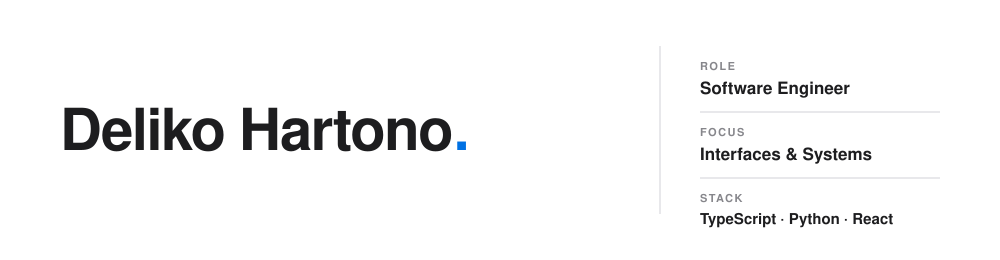

**[delikohartono.vercel.app](https://delikohartono.vercel.app/)**

---

### About

I work across the stack — frontend interfaces and the backend systems behind them.

### Focus

**Engineering**
React and TypeScript on the front end. Node.js and PostgreSQL underneath.

**Design**
UI and interaction design for the products I build.

### Stack

<kbd>TypeScript</kbd> <kbd>Python</kbd> <kbd>React</kbd> <kbd>Next.js</kbd> <kbd>Node.js</kbd> <kbd>PostgreSQL</kbd>

---

<picture>
  <source media="(prefers-color-scheme: dark)" srcset="https://github-readme-stats.vercel.app/api?username=Okiled&show_icons=true&hide_border=true&hide_rank=true&bg_color=000000&title_color=f5f5f7&text_color=86868b&icon_color=2997ff">
  
</picture>
<picture>
  <source media="(prefers-color-scheme: dark)" srcset="https://github-readme-stats.vercel.app/api/top-langs/?username=Okiled&layout=compact&hide_border=true&bg_color=000000&title_color=f5f5f7&text_color=86868b&langs_count=6">
  
</picture>

